<div align="center">

#  NovaPhone

**A full-stack MERN e-commerce platform for smartphones — with an AI shopping assistant, secure payments, and production-grade resilience engineering.**

[](https://nova-phone-web.vercel.app)


[Live Demo](https://nova-phone-web.vercel.app) · [Report a bug](../../issues) · [Features](#-key-features) · [Screenshots](#-screenshots) · [Tech Stack](#-tech-stack) · [Getting Started](#-getting-started)

</div>

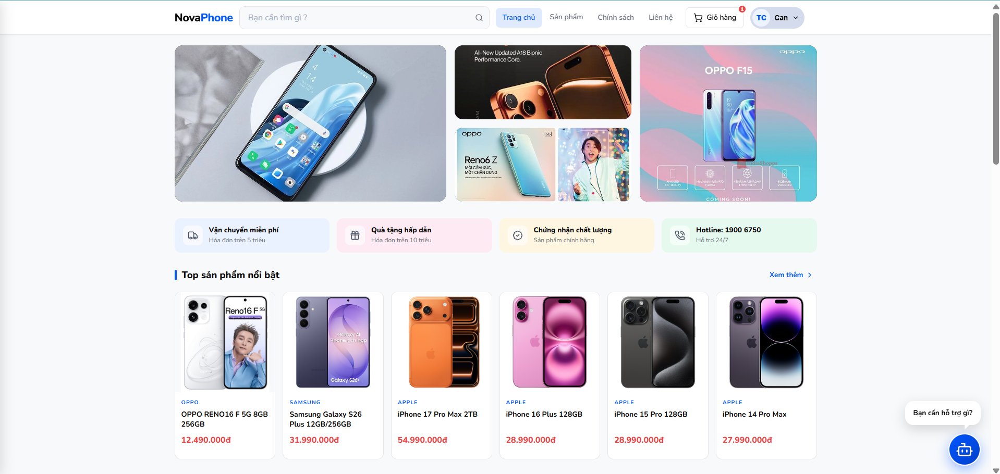

---

## 📝 About the Project

NovaPhone is a complete e-commerce web application for browsing and purchasing smartphones, built to demonstrate real-world, production-level full-stack engineering — not just CRUD. Beyond the standard shopping cart and checkout flow, the project includes an **AI-powered shopping assistant**, **real payment processing with Stripe**, and several **resilience patterns** (automatic failover, non-blocking I/O, race-condition-free data fetching) that were designed and debugged the way they would be in a real production environment.

The codebase is organized as an **npm workspaces monorepo**, separating the Express API, the React frontend, and a shared types package — the same structural pattern used by many production JS/TS codebases.

---

## ✨ Key Features

### 🛍️ Customer Experience
- Product catalog with search, brand/price filtering, and sorting
- Product detail pages with image galleries and full specs
- Shopping cart & multi-step checkout
- **Stripe Checkout** integration with webhook-driven order status updates
- Order history & order detail tracking
- Threaded product reviews with ratings, replies, and a **"Verified Purchase"** badge
- Email OTP verification on signup (via a transactional email API)

### 🤖 AI Shopping Assistant
- Conversational chatbot powered by **Google Gemini** with **function calling** — the AI can query the live product database in real time to recommend phones based on natural-language requests (e.g. *"tìm điện thoại chụp ảnh đẹp"*)
- Multi-model failover chain and a **graceful degraded mode** that falls back to direct database search if every AI model is temporarily unavailable — the conversation never hard-fails

### 🔐 Admin Dashboard
- Full CRUD for products, categories, orders, and users
- Order management with status updates
- Review moderation (reply as admin, delete, view all)
- Role-based access control (JWT + route guards)

### ⚙️ Engineering Highlights
*(the part of this project I'm personally proudest of — see [below](#-under-the-hood-engineering-highlights))*
- Resolved a silent React race condition that could serve unfiltered search results
- Redesigned the OTP email pipeline to survive a real hosting-platform network restriction (SMTP port blocking) without ever blocking the HTTP response
- Fixed SPA deep-link 404s on Vercel
- Idempotent, atomic stock decrement on order placement to prevent overselling under concurrent checkouts

---

## 📸 Screenshots

> All screenshots below are from the live deployment.

### 🏠 Homepage & Product Discovery
This is your strongest visual asset — the banner carousel, clean product cards, and category browsing all show off the frontend design work.

*(see the hero screenshot at the top of this README)*

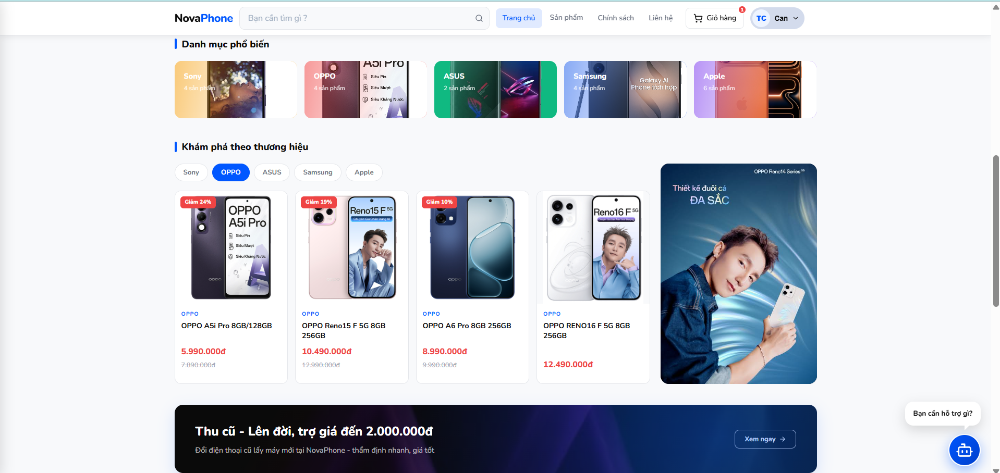

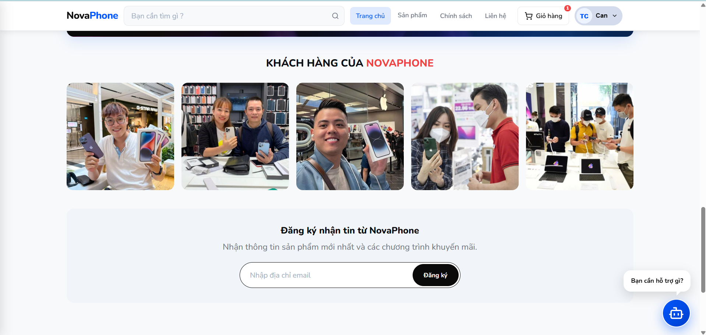

### 📱 Product Detail
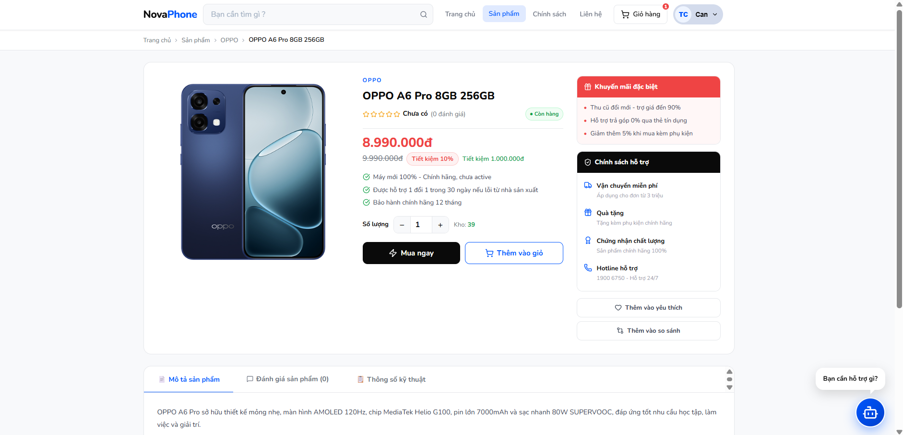

### 🤖 AI Chatbot in Action
This is the most technically differentiating feature of the project — worth its own dedicated, clear screenshot (or better, a short screen-recording GIF) showing an actual back-and-forth conversation where the bot recommends a real product.

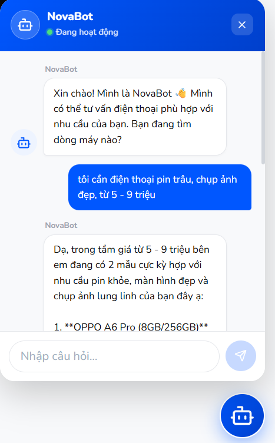
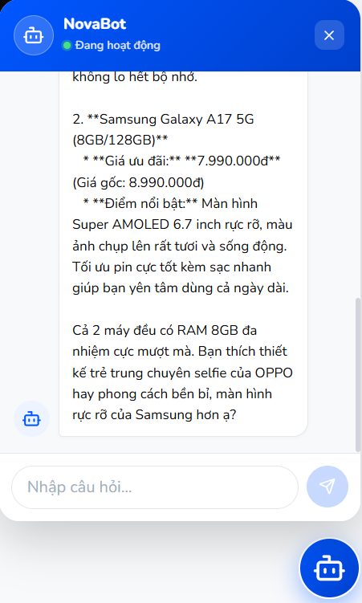

### 🛒 Cart & Checkout
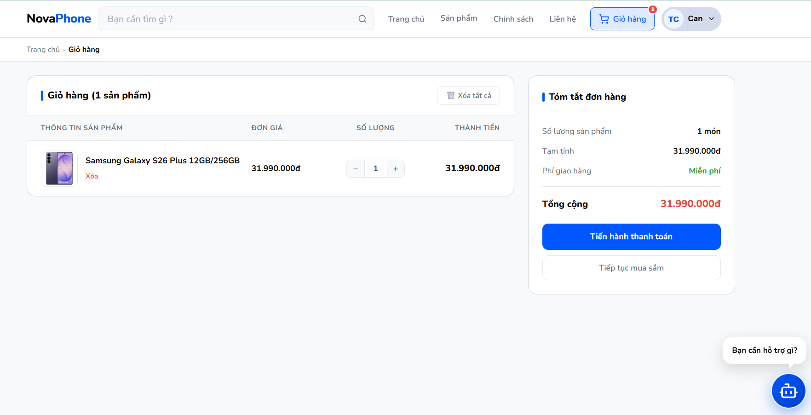
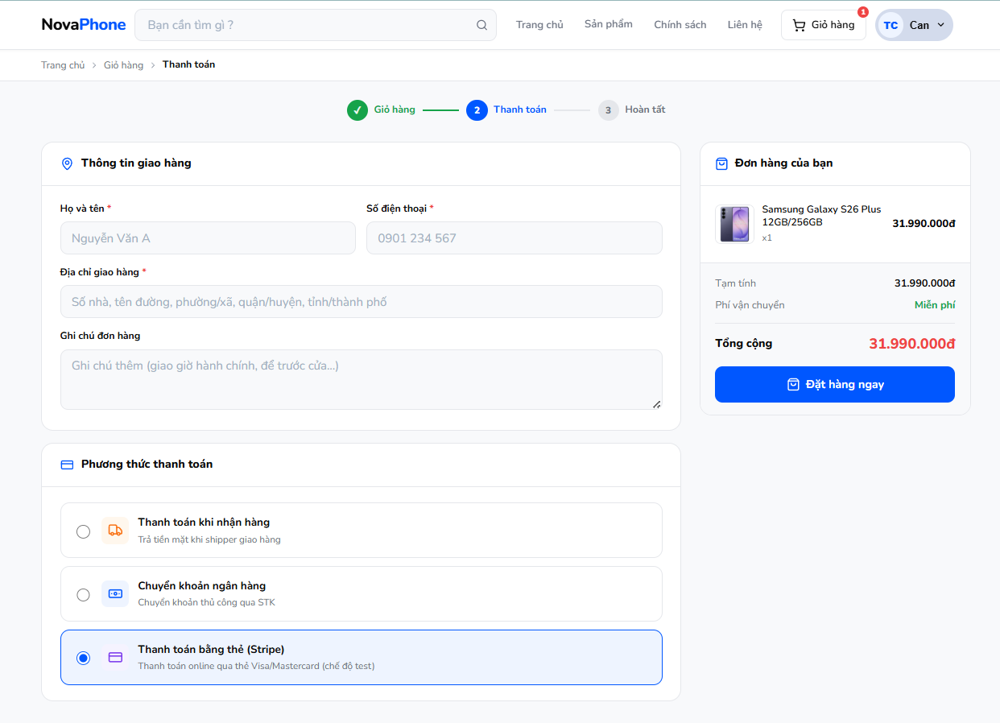
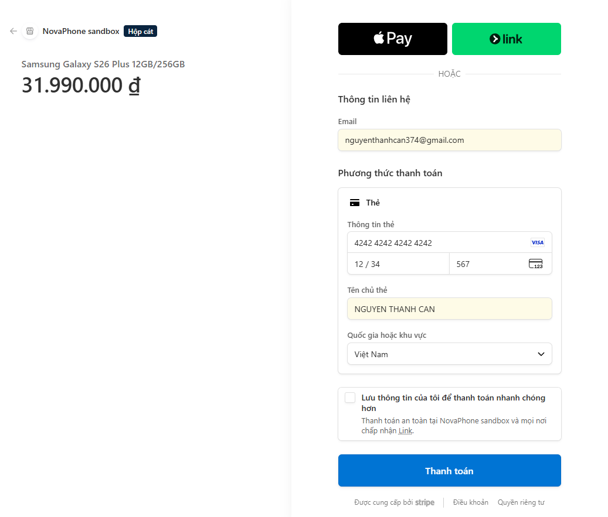
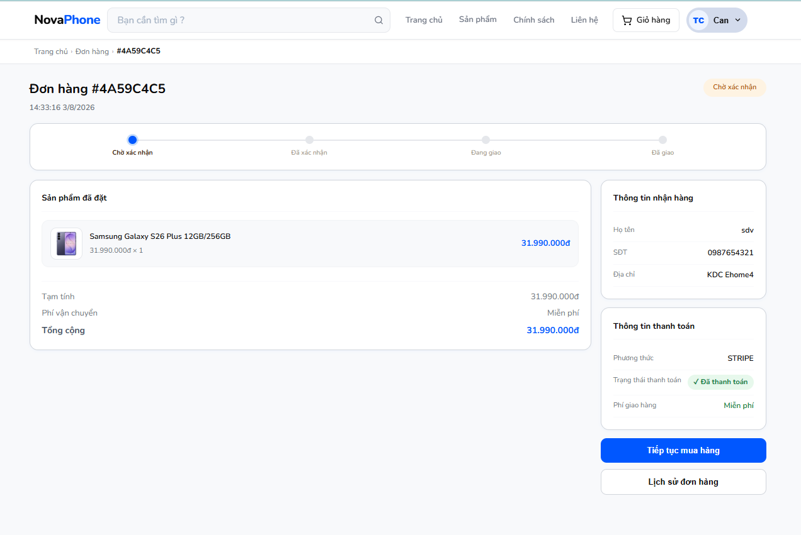

### 🧑‍💼 Admin Dashboard
Don't skip this — an admin panel is one of the clearest signals to a recruiter that you can build past just the customer-facing side.

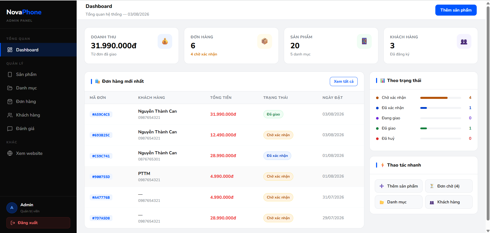
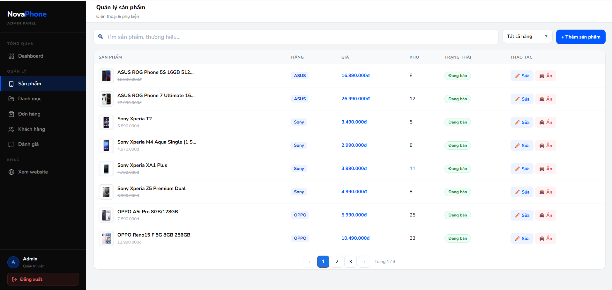

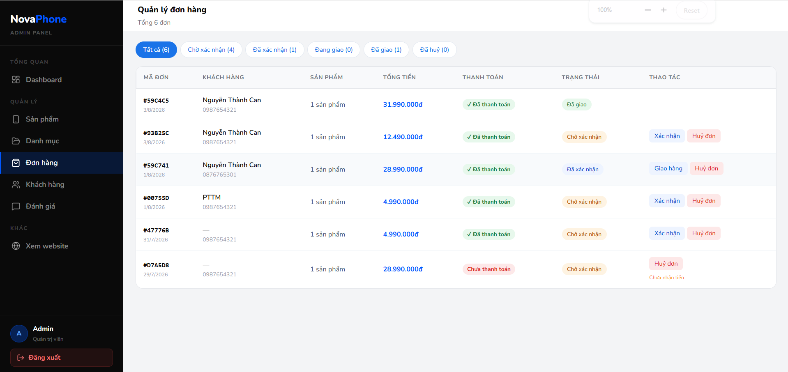

### 📱 Mobile Responsiveness
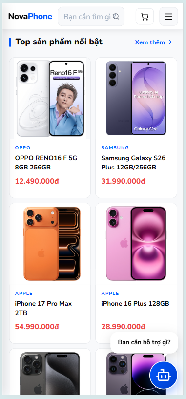

---

## 🧠 Under the Hood: Engineering Highlights

Most tutorials stop at "it works on my machine." Shipping this to real hosting (Render + Vercel + MongoDB Atlas) surfaced several production-grade problems that don't show up in local development — here's how each was diagnosed and fixed:

| Problem | Root Cause | Fix |
|---|---|---|
| Registration UI froze on "Signing up..." indefinitely | Render's free tier blocks outbound SMTP ports (25/465/587); the OTP email `await` hung until timeout | Rebuilt the email pipeline on an HTTPS-based transactional email API and made sending non-blocking, so the HTTP response never waits on it |
| AI chatbot occasionally failed with "service unavailable" | Gemini API free-tier requests can return `503` under high demand | Added retry-with-exponential-backoff plus a 3-model failover chain, and a final degraded mode that answers from the database directly if every model is down |
| Direct links like `/orders/:id` returned a platform-level 404 on Vercel | Vercel looks for a matching static file before React Router can handle the route on hard navigation | Added a SPA fallback rewrite so all unmatched routes resolve to `index.html` |
| Searching for a term with no matches sometimes displayed the entire catalog instead of zero results | A React race condition: two effects both fetched products on initial mount, and the un-filtered request occasionally resolved *after* the filtered one, silently overwriting the correct state | Collapsed the logic into a single effect deriving the search term directly from the URL, removing the duplicate state and the race entirely |

---

## 🛠️ Tech Stack

**Frontend**
- React 19 + Vite
- React Router
- Axios
- Custom design system (Nunito typeface, `#0057FF` brand color, 1280px content width)

**Backend**
- Node.js + Express
- MongoDB + Mongoose
- JWT authentication, bcrypt password hashing
- Cloudinary (image uploads)
- Stripe (payments + webhooks)
- Google Gemini API (AI chatbot, function calling)
- Brevo API (transactional email)

**Infrastructure**
- MongoDB Atlas (database)
- Render (backend hosting)
- Vercel (frontend hosting)
- npm workspaces monorepo

---

## 🏗️ Project Structure

```
NovaPhone/
├── apps/
│   ├── api/                 # Express backend
│   │   └── src/
│   │       ├── controllers/
│   │       ├── models/
│   │       ├── routes/
│   │       ├── middlewares/
│   │       ├── services/
│   │       └── utils/
│   └── web/                 # React (Vite) frontend
│       └── src/
│           ├── pages/       # user / admin / auth route pages
│           ├── components/
│           └── api/         # axios API layer
├── packages/
│   └── shared-types/        # constants & enums shared by api + web
└── package.json              # npm workspaces root
```

---

## 🚀 Getting Started

### Prerequisites
- Node.js 18+
- A MongoDB Atlas connection string
- API keys for: Cloudinary, Stripe, Google Gemini, Brevo

### Installation

```bash
git clone https://github.com/thanhcannguyen/NovaPhone.git
cd NovaPhone
npm install
```

### Environment Variables

Create `apps/api/.env`:

```env
PORT=5000
MONGO_URI=your_mongodb_atlas_connection_string
JWT_SECRET=your_jwt_secret
CLIENT_URL=http://localhost:5173

BREVO_API_KEY=your_brevo_api_key
BREVO_SENDER_EMAIL=your_verified_sender_email

CLOUDINARY_CLOUD_NAME=...
CLOUDINARY_API_KEY=...
CLOUDINARY_API_SECRET=...

GEMINI_API_KEY=...

STRIPE_SECRET_KEY=...
STRIPE_WEBHOOK_SECRET=...
```

Create `apps/web/.env`:

```env
VITE_API_URL=http://localhost:5000/api
```

### Run locally

```bash
npm run dev:api    # starts the backend on :5000
npm run dev:web    # starts the frontend on :5173
```

---

## 🌐 Deployment

| Service | Platform |
|---|---|
| Database | MongoDB Atlas |
| Backend API | [Render](https://render.com) |
| Frontend | [Vercel](https://vercel.com) |

Live demo: **[nova-phone-web.vercel.app](https://nova-phone-web.vercel.app)**

---

## 👤 Author

**Nguyễn Thành Can**
Built as a portfolio project to demonstrate full-stack MERN development, third-party API integration, and production debugging.

- GitHub: [@thanhcannguyen](https://github.com/thanhcannguyen)

</div>
